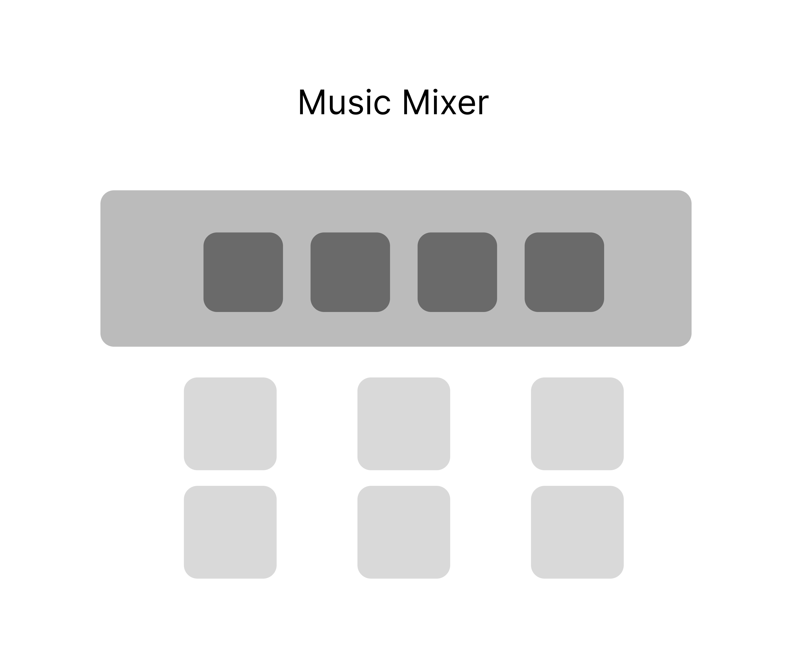
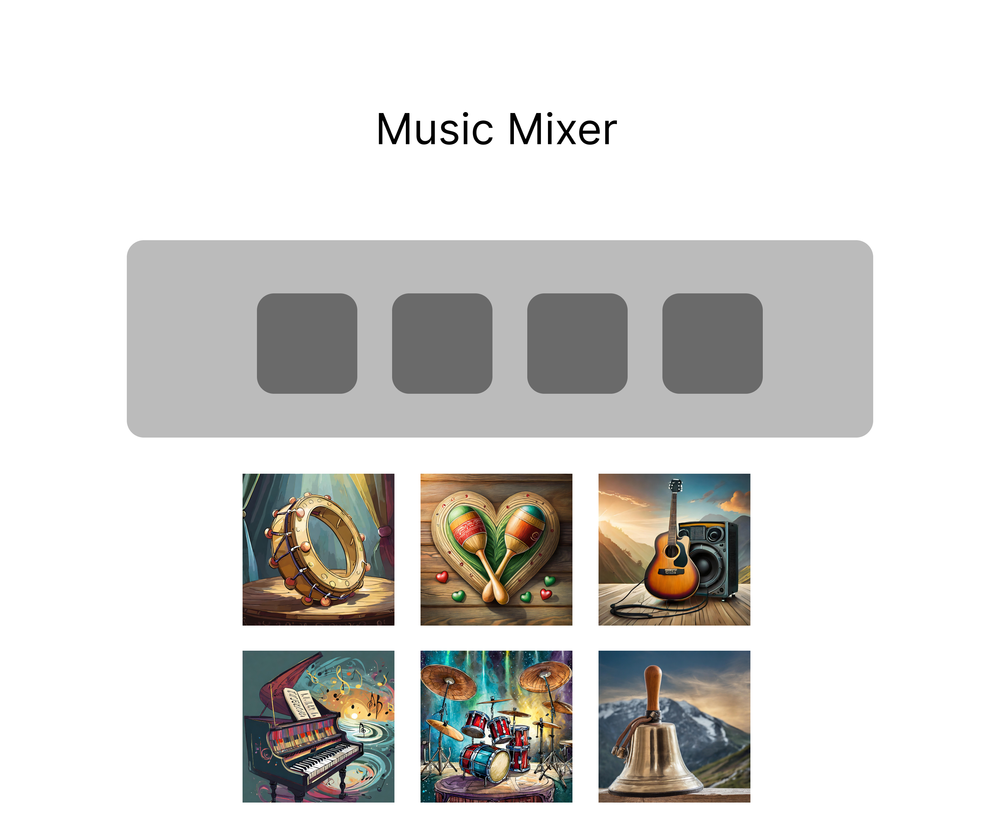

# Music Mixer Project
In this Music Mixer there will be presented six audio files with sounds of musical tools: guitar, piano, drums, bell, tambourine and maracas. 
These files can be puted at the music table where they will play simultaneously. 

## Images

## Installation
This is no installatin required.

## Usage
Open index.html in the browser of your choice.

## Contributing
1. Fork it!
2. Create your feature branch: `git checkout -b my-new-feature`
3. Commit your changes: `git commit -am 'Add some feature'`
4. Push to the branch: `git push origin my-new-feature`
5. Submit a pull request :D

## History
February 7th, 2024

## Credits
Dina Bondarchuk & Harnoorpreet Kaur 

## License
MIT license